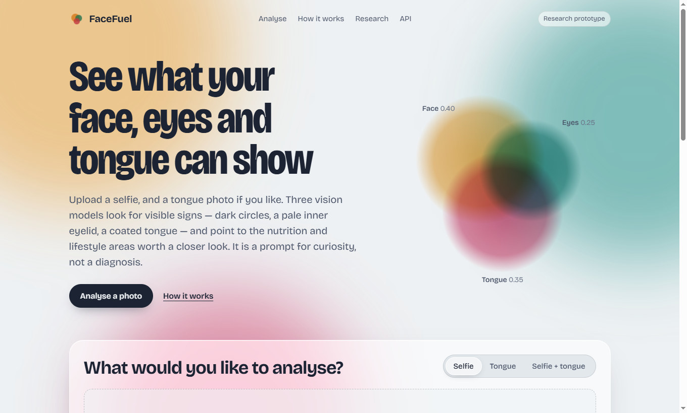
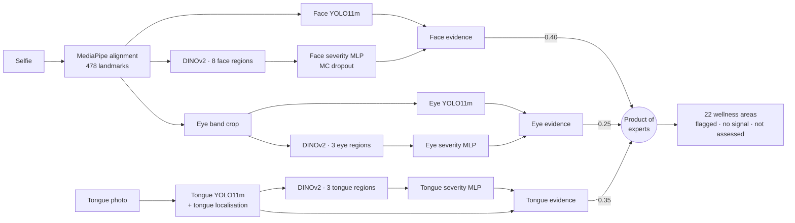

# FaceFuel

[](https://doi.org/10.5281/zenodo.19394708)
[](https://doi.org/10.5281/zenodo.19411317)
[](https://doi.org/10.5281/zenodo.19468059)
[](LICENSE)

**Tri-modal computer vision for wellness screening: face, eyes and tongue, from ordinary smartphone photos.**

▶ [Watch the promo video](https://youtu.be/_RNtt8QNQOs)

FaceFuel looks for visible signs (dark circles, a pale inner eyelid, xanthelasma, a coated
or fissured tongue) and maps them to nutrition and lifestyle areas worth a closer look. It
combines evidence from three vision pipelines and reports, for every area, which model the
evidence came from and which areas it could not assess at all.

> [!WARNING]
> **Research prototype. Not medical advice.** FaceFuel is not a medical device and does
> not diagnose, treat or rule out any condition. Its models have **not** been validated
> against blood tests or clinical diagnoses. Visual signs have many possible causes. Talk to a
> qualified healthcare professional before making any health decision.



---

## How it works

Each modality runs the same five-stage pattern, then the three are fused:



1. **Locate:** MediaPipe FaceLandmarker aligns the face; the eye band is cut from the aligned face. The tongue is located in its own photo.
2. **Detect:** one YOLO11m detector per modality marks visible signs.
3. **Describe:** DINOv2 ViT-S/14 embeds fixed anatomical regions into one vector per photo (3,072-d face, 1,152-d eye, 1,152-d tongue).
4. **Grade:** a per-class severity MLP with Monte Carlo dropout (20 passes) grades each *detected* sign and estimates its own uncertainty.
5. **Fuse:** detected signs map to deficiency/wellness areas; per-modality evidence is combined by a weighted product of experts (face 0.40, tongue 0.35, eye 0.25). A modality with no evidence for an area contributes nothing, not a guess.

Every area in the response carries `status` (`flagged`, `no_signal` or `not_assessed`), the
modalities that contributed (`sources`), the modalities that *could* have
(`assessed_by`), and the specific features behind it (`evidence`).

## Results (v4.2 — models in use)

All numbers are on a **held-out test split** that no model was trained or tuned on:
images that were in the v4 validation set and never (even as a near-duplicate) in v4
training, so old and new models are compared fairly. Full tables, including per-class
results: [docs/model_comparison.md](docs/model_comparison.md).

| Modality | Detector (YOLO11m) mAP@0.5 | Severity MLP mean F1 | Active classes | Models in use |
|---|---|---|---|---|
| Eye | **0.991** | **0.901** | 6 / 6 | v5 detector + v5 MLP |
| Tongue | **0.841** | **0.701** | 14 / 18 | v4 detector + v5 MLP |
| Face | **0.672** | **0.778** | 9 / 10 | v5 detector + v5 MLP |

- **Eye:** trained with 745 photos of normal eyes as negatives; only **6 % of normal eyes get a false flag** (the previous model flagged 94 %). Scleral icterus keeps its three-layer guard (0.65 detector threshold, LAB colour gate, detector confirmation required).
- **Tongue:** the retrained detector scored lower (0.804) than the existing one, so the existing detector stays in service. Four classes (no coating, purple tongue, angular stomatitis, median rhomboid glossitis) still have no training data and are disabled.
- **Face:** retrained after fixing a class-shift bug in the v4 training labels. Acne, vitiligo and butterfly rash are now active (0.870 / 0.854 / 0.430 AP); only blackhead lacks data. Strong classes: dark spot 0.888, acne 0.870, vitiligo 0.854.

> **How to read these numbers.** They are image-level scores on curated dataset photos,
> mostly close-ups. They are **not** measures of nutritional or medical accuracy, and real
> selfies are harder: the face severity model still has no healthy-face training photos,
> so FaceFuel reports a sign only when the detector confirms it. Earlier published v4
> figures (eye 0.993, tongue 0.871, face 0.559) were inflated by train/validation
> duplicates and, for face, scored against shifted labels. See
> [docs/RESEARCH_NOTES.md](docs/RESEARCH_NOTES.md) §1.

### Project history

| Version | Paper | Modalities | Headline result |
|---|---|---|---|
| v1–v2 | [Paper 1](https://doi.org/10.5281/zenodo.19394708) | Face | YOLOv8m mAP 0.790 (11 classes, 5,721 images); mean F1 0.677; 58 ms/image |
| v2 | [Paper 2](https://doi.org/10.5281/zenodo.19411317) | Face + tongue | Tongue YOLOv8m mAP 0.812 (12 classes, 9,125 images); PoE fusion 0.55 / 0.45 |
| v3 | [Paper 3](https://doi.org/10.5281/zenodo.19468059) | Face + tongue + eye | Eye mAP 0.913 (3 classes); face YOLO11m mAP 0.872; < 235 ms |
| v4 | — | Face + tongue + eye | Scaled datasets; reported eye 0.993 / tongue 0.871 / face 0.559 on validation splits later found to leak duplicates of training images |
| v4.2 | — | Face + tongue + eye | Clean deduplicated datasets, face labels fixed, eye negatives, held-out test split: eye 0.991 / tongue 0.841 / face 0.672 |

## Quick start

Requires Python 3.10+ and, ideally, an NVIDIA GPU (all models together use < 2 GB VRAM; CPU works, slower).

```bash
git clone https://github.com/M-O-J-U/FaceFuel.git && cd FaceFuel
pip install torch torchvision --index-url https://download.pytorch.org/whl/cu128   # or /whl/cpu
pip install -r requirements.txt

# model weights (~135 MB) — download the release asset into ./weights, or, if you
# trained locally, gather them:  python scripts/collect_weights.py
python server.py          # → http://localhost:8000   (interactive API docs at /docs)
```

Docker and hosting options are covered in [docs/DEPLOYMENT.md](docs/DEPLOYMENT.md).

## API

| Endpoint | Input (multipart) | Runs |
|---|---|---|
| `POST /analyze` | `file`: selfie | face + eye |
| `POST /analyze/tongue` | `file`: tongue photo | tongue |
| `POST /analyze/combined` | `face`: selfie, `tongue`: tongue photo | face + eye + tongue |
| `GET /health` | | per-modality model status |
| `GET /api/info` | | class lists, active/inactive classes, coverage per modality |

```bash
curl -F file=@selfie.jpg http://localhost:8000/analyze
curl -F file=@tongue.jpg http://localhost:8000/analyze/tongue
curl -F face=@selfie.jpg -F tongue=@tongue.jpg http://localhost:8000/analyze/combined
```

Abridged response:

```json
{
  "status": "success",
  "modalities_run": ["face", "eye"],
  "face_features": {
    "dark_circle": {"severity": 0.95, "level": "high", "confidence": 0.97,
                    "yolo_count": 2, "detected_by": ["severity_mlp", "yolo(x2)"]}
  },
  "eye_features": {},
  "unconfirmed_signals": {"face": {}, "eye": {"conjunctivitis": 0.87}},
  "top_insights": [
    {"rank": 1, "issue": "iron_deficiency", "probability": "33.3%", "priority": "HIGH",
     "sources": ["face"], "evidence": ["face:dark_circle"],
     "top_foods": ["spinach", "lentils", "red meat"],
     "advice": "Pair iron-rich foods with vitamin C to boost absorption. A blood test (ferritin, CBC) is the only way to confirm."}
  ],
  "deficiency_analysis": {
    "iron_deficiency":   {"status": "flagged", "probability": 0.3333, "evidence_strength": 0.95,
                          "sources": ["face"], "assessed_by": ["face", "eye"], "...": "..."},
    "folate_deficiency": {"status": "not_assessed", "probability": 0.0,
                          "sources": [], "assessed_by": [], "...": "..."}
  },
  "summary": {"flagged": 3, "no_signal": 12, "not_assessed": 7},
  "aligned_face_b64": "<jpeg>",
  "warnings": [],
  "disclaimer": "FaceFuel is a research prototype for wellness awareness only. ..."
}
```

`probability` is each area's **share of the overall signal** among flagged areas (it sums
to 1 across them). It is not the probability that you have a deficiency. If no face is found,
`/analyze` returns `{"status": "no_face_detected", "message": ..., "tips": [...]}`.

## Repository layout

```
server.py                FastAPI app — API + web frontend
facefuel/                runtime package
  paths.py               every model-file location (env-overridable), resolved in one place
  schema.py              class lists, inactive classes, 22-area framework, feature→area map
  models.py              shared DINOv2, severity-MLP loader (active/inactive heads), YOLO
  face.py eye.py tongue.py   per-modality pipelines
  evidence.py fusion.py  evidence rules, product-of-experts fusion, provenance
static/index.html        web frontend (no build step)
pipeline/                training pipeline, run in order from the repo root
  01_download_datasets.py  02_diagnose_datasets.py  03_merge_{face,tongue,eye}.py
  03b_build_clean_v5.py (dedupe, fix face labels, add negatives, held-out test split)
  04_train_yolo.py  05_extract_features.py  06_train_severity_mlp.py
scripts/                 collect_weights.py, compare_models.py, domain_shift_probe.py, scan_project.py
tests/                   pytest — fusion/provenance (no GPU) + API smoke tests (need weights)
docs/                    PROJECT_SUMMARY, RESEARCH_NOTES, DEPLOYMENT, PUBLISH_CHECKLIST, figures
legacy/                  v1–v3 code kept for reproducibility of Papers 1–3 (not used by the server)
```

Run the tests with `pip install -r requirements-dev.txt && python -m pytest tests -q`.

## Limitations

- **No clinical validation yet.** No model has been compared against blood tests. The mapping from visual signs to nutrition areas is literature-informed and expert-specified, not learned from outcome data.
- **Domain shift.** The models were trained on curated dataset images. Eye training now includes normal eyes, but face training still has no healthy faces, and detectors can over-fire on real selfies (e.g. drooping eyelid).
- **Coverage gaps.** Five classes still have no training data (blackhead and four tongue classes), and vitamin D and riboflavin have no route to evidence. They are reported as *not assessed*.
- **Representativeness.** Training data skin-tone diversity has not been audited.

The research plan to address these is in [docs/RESEARCH_NOTES.md](docs/RESEARCH_NOTES.md).

## Citation

```bibtex
@misc{muhammad2026facefuel,
  author = {Muhammad, Abdul Moiz},
  title  = {FaceFuel: A Multi-Stage Heterogeneous Fusion Pipeline for Non-Invasive Nutritional Deficiency Screening from Facial Imagery},
  year   = {2026}, publisher = {Zenodo}, doi = {10.5281/zenodo.19394708}
}
@misc{muhammad2026bimodal,
  author = {Muhammad, Abdul Moiz},
  title  = {Multi-Modal Visual Health Assessment Through Product-of-Experts Posterior Fusion of Facial and Lingual Biomarkers},
  year   = {2026}, publisher = {Zenodo}, doi = {10.5281/zenodo.19411317}
}
@misc{muhammad2026trimodal,
  author = {Muhammad, Abdul Moiz},
  title  = {TriModal: Face, Tongue, and Eye as Complementary Visual Channels for Non-Invasive Nutritional and Lifestyle Deficiency Screening},
  year   = {2026}, publisher = {Zenodo}, doi = {10.5281/zenodo.19468059}
}
```

## Licence

**[PolyForm Strict 1.0.0](LICENSE)**: you may use this software for personal,
research and other noncommercial purposes only. You may **not** use it commercially,
redistribute it, or publish modified or derived versions. **Commercial licensing is
available.** Contact mojuaries111@gmail.com. The papers are published on Zenodo
under CC BY-NC-ND 4.0. Trained weights are derived from third-party datasets with their
own licences.

## Author

**Abdul Moiz Muhammad (MOJU)**, independent researcher, COMSATS University Islamabad, Wah Cantt, Pakistan.
ORCID [0009-0006-2795-5271](https://orcid.org/0009-0006-2795-5271) · GitHub [@M-O-J-U](https://github.com/M-O-J-U)
